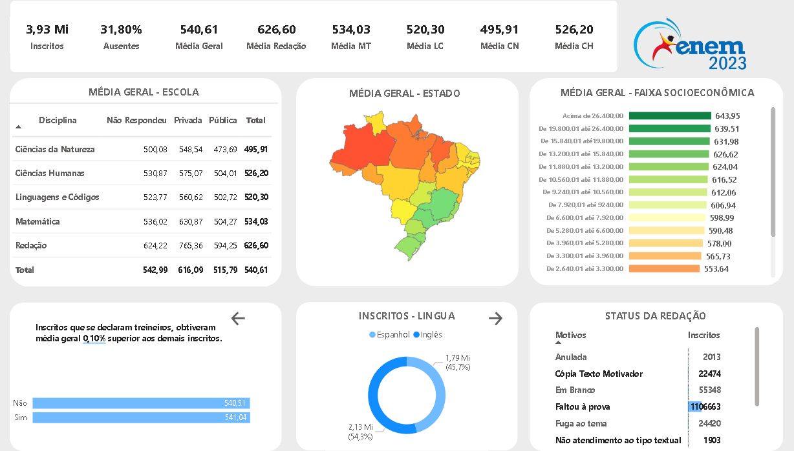

#### Resumo do Projeto
Este projeto analisa os dados do Exame Nacional do Ensino Médio (ENEM) para identificar padrões e tendências nas notas dos participantes, influência de fatores socioeconômicos e demográficos no desempenho dos estudantes, e a distribuição de participantes por cor/raça. O projeto foi desenvolvido utilizando um notebook Jupyter para tratamento dos dados e análise exploratória inicial, e o Power BI para visualizações interativas e insights adicionais.

#### Datasets Utilizados
- **Dados do ENEM**: Os dados incluem notas dos participantes nas diferentes áreas de conhecimento, informações demográficas, e dados socioeconômicos. Foram limpos e preparados para análise no Jupyter Notebook antes de serem importados para o Power BI.

#### Análises Realizadas
**Análise Exploratória de Dados no Jupyter Notebook**:
   - **Tratamento dos Dados**: Limpeza de dados, tratamento de valores faltantes e outliers.
   - **Visualizações**: Distribuição das notas, comparação de médias por tipo de escola, e análise de variabilidade nas notas.
   - **Modelagem**: Uso de Random Forest para avaliar a importância das features nas notas de redação e na presença nas provas.

**Visualizações no Power BI**:
   - **Dashboard Interativo**: Permite aos usuários explorar as médias de notas por tipo de escola, desempenho por cor/raça e gênero, e a distribuição de notas por faixa socioeconômica.
   - **Insights Adicionais**: Análise da distribuição de participantes por cor/raça, e correlações entre renda familiar e desempenho nas provas.

#### Conclusões Principais
- **Desigualdade Educacional**: Estudantes de escolas privadas tendem a ter desempenho superior, especialmente em Matemática e Redação.
- **Influência Socioeconômica**: Existe uma correlação positiva entre a renda familiar e o desempenho no ENEM, com estudantes de maior renda apresentando médias de notas significativamente mais altas.
- **Disparidades de Gênero**: Mulheres apresentaram melhor desempenho em Redação, enquanto homens tiveram melhores resultados em Matemática e Ciências da Natureza.
- **Impacto Racial**: Participantes brancos e amarelos apresentaram médias mais altas que os demais grupos raciais, indicando possíveis desigualdades de acesso a recursos educacionais.

#### Recomendações
- **Fortalecimento das Escolas Públicas**: Investimentos em recursos e metodologias de ensino, especialmente em áreas onde os estudantes de escolas públicas apresentam defasagem.
- **Políticas de Inclusão**: Desenvolvimento e implementação de políticas que promovam equidade educacional, com foco em grupos historicamente desfavorecidos.
- **Fomento à Educação de Qualidade para Todos**: Ampliação de programas que ofereçam suporte adicional a estudantes de baixa renda e de grupos minoritários.

#### Como Usar este Projeto
- **Para Educadores e Políticos**: Utilizar as insights para moldar políticas educacionais e práticas pedagógicas.
- **Para Pesquisadores**: Explorar os datasets e visualizações para estudos adicionais sobre desigualdades educacionais no Brasil.
- **Para o Público em Geral**: Acessar o dashboard no Power BI para visualizar e entender as tendências educacionais e sociais refletidas nos dados do ENEM.

#### Visualização do Dashboard

